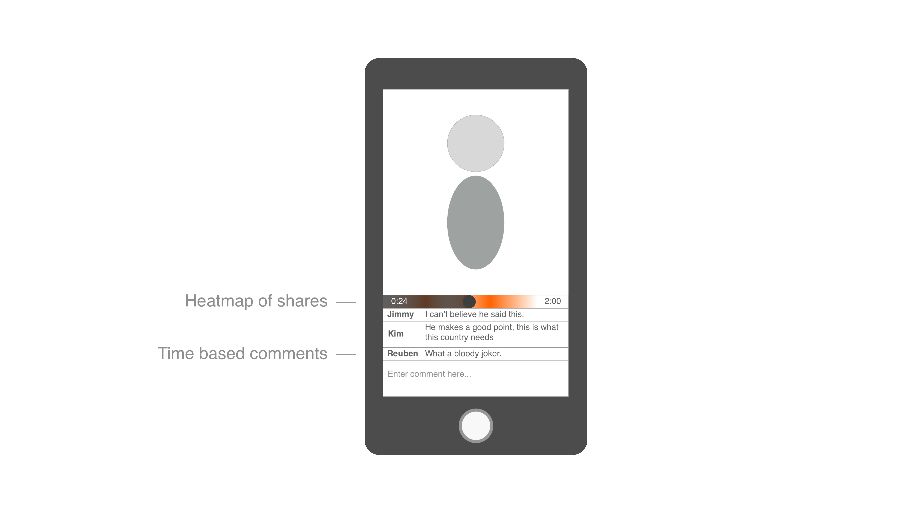

# Proposal: Hot-Take
[Captain's Log](https://docs.google.com/document/d/1_xTiX_AcGPrPmlDdi0WIgWZrGFMB_M9RmbVDO5YmOJU/edit?usp=sharing)
*A log of what the team has been up to. Transparent log of team planning and collaboration*
## Introduction 
Old media is losing its grip on today’s population, and with it, people are becoming less informed. Our proposal is an app that gives people a hot-take on real news stories and events in a way that is not only engrossing, but that engenders conversation.

It’s Twitch.tv meets Snapchat, for news :wink:

Many people are uninterested in reading an article for two minutes, but are more than happy to spend half an hour scrolling through an instagram feed or watching someone play video games.

We want our application to feel as immediately rewarding as taking a selfie or swiping left and right through Tinder, but still be informative and have as much depth and intrigue as news is able to offer.

The core of our application is based on video, and a timestamp-based commenting system. Users can swipe left and right to change videos and up and down to vote on them. Votes are used to predict content that users want to see in the future, along with determining the order of videos. Users can interact with the video by commenting at particular time or selecting snips of the video to share. When watching the video, comments appear at their correlated time and a heatmap is visible of the aggregated snippets. 

### Audience
We will be targeting teens and millennials, mostly people that don’t access traditional forms of news-media. We want to be engaging people that only have a few moments to see what’s up, want to be entertained by their news, and want to participate in the conversation.

### Aim
The aim behind our application and the processes involved in creating it is to expose people to news, allow them to be involved in it, and to have a novel and engrossing experience in a short period of time.

### Related offerings
Our application’s initial design and goals take inspiration from a number of existing applications and services.
* Snapchat
	* Stories Feature and directional tile-based navigation
* Twitch.tv
	* Live commenting
	* Consuming video en masse
* Soundcloud
	* Timestamp based commenting
* Genius
	* Annotation of external content
* Reddit
	* Virality
	* Curation through voting system
* Medium
	* Highlighting important parts of content
* Youtube
	* Serving video content
	* Recommendation system
*Panda TV
	*Real-live communication and comment
Our application differs from these applications by being entirely mobile focused with emphasis on time. Other applications, such as Twitch or Medium, are built for a user base that has time to consume lots of content in an extended period of time. Hot-Take interactions take only a handful of minutes and show only the most important things. To achieve this content is only a couple of minutes long, the heat map shows the most popular parts, and visible comments directly correlate to what's on screen.

The depth of user interaction is also a lot deeper than other news aggregations. For example reddit allows sharing of news links and media and community response through commenting. Hot-Take allows users fine grained control over which segment of the news they want to talk about. The heatmap also allows the user base as a whole to decide what the most important parts of the video are. 

## Team:
### Roles and Responsibilities

#### Fang Wan
|ID|s43983687|
|---|---|
|Role|Design and content|
|Degree  |Master of Computer Science|

#### Adam Smith
|ID|s43944875|
|---|---|
|Role|Back-end and native code|
|Degree|Bachelor of Information Technology|

#### Zachariah Strauss
|ID|s43587713|
|---|---|
|Role|Front-end and protoyping|
|Degree|Bachelor of Information Technology|

### Decisions 

Decisions will be made collaboratively or without consensus through a team vote. As there are only three members in the team this will always yield a result. 

### Poor Performance and Conflict

Any conflicts between team members will be resolved through discussion as soon as they happen. The member not involved will act as a mediator. When a resolution has been agreed upon it will be monitored and if not upheld the conflict will be reviewed again. If conflict continues it will be brought up with the tutors or course coordinator.

Poor performance will be an issue if team members don’t get their allocated work completed as specified in the Plan. Offending members will have to complete additional work in proportional to the work they were supposed to do. 

## Communications
### Meetings

Meetings will be held during the workshop sessions on Wednesday 4pm along with ‘virtual’ slack meetings when necessary. 

### Storage

All files will be stored on github and will make use of github’s inbuilt version control systems. Internal files, such as brainstorming, will be stored on google drive. 

### Social Platforms

Slack will be used for all communication outside workshop sessions. Slack’s excellent plugin and bot functionality allows integration with github and can provide organisational notifications for improved productivity. Zenhub will be used to manage tasks and issues as it directly integrates with git and is very feature rich. 

 
## Plan:
There will be four stages during the development cycle of the application: research, requirements, design, and construction. It is not the intention of this team to have completed this cycle once during the semester, but to continue to complete it as we further iterate upon our design.

### Research
Research is not limited to gathering information through passive means. We will be developing a number of prototypes during development, and these prototypes will provide necessary information to adjust the scope of the application and allow for further investigation of requirements after we use them to do some test on people.

### Requirements
The process of gathering requirements involves background research, context investigation and problem space definition.

Our requirements will be gathered through the following techniques:
*  Lead user interviews
	* To gather information about those that we are interested in targeting the most
* Camera studies
	* To gather information about the processes involved in interacting with the application
* History interview
	* To gather information about changes in user’s past experiences with social media and news
* Process mapping
	* To confirm the user interface being designed is appropriate

### Design
The design will involve a number of mobile and technologies.

During early prototyping stages, web technologies will be utilised because of their simplicity and the team member’s familiarity with them. During latter stages, native code will be used in order to provide more natural input options.

### Milestones

- [ ] Gather requirements
- [ ] Implement core functionality in desktp chrome extension
- [ ] Design basic app
- [ ] Connect application to content
- [ ] Gather feedback
- [ ] Implement final prototype

#### Gather requirements - 10/09
Using the techniques outlined in the requirements section of the plan, we will gain understanding of the needs of our users, the problem space, and the intentions for our application. 

#### Implement core functionality in desktop chrome extension - 14/09
We will create a basic live-commenting system that interacts with existing videos like youtube. We will use this design to do further user testing and examine the core mechanic behind our application. 

#### Design basic app - 5/10
We will develop a basic implementation of our application to be used in further requirements gathering and user analysis studies. This application will be implemented in a simple cross-platform framework like React native, Cordova, or Xamarin

#### Connect application to content - 14/10
Using various APIs, we will connect our application to video content to simulate the experience one might have when using the application. 

#### Gather feedback - 19/10
Using our basic application, we will run process mapping and camera studies on users to test how they will use it and how they feel about it, whether the core mechanics are intuitive, and address any flaws in our design.

#### Implement final prototype - 28/10
During this final stage, small changes will be added and further user-testing will be done as required.

## Stand-ups
This is where stand-up reports will be logged with the following format:

|Week|#8|
|----|----
|Team member name|Adam|
|What did I do since last meeting?|Created desktop demonstration|
|What will I do now until the next meeting?|Move development side over to react-native|
|What is stopping me from getting stuff done?|Unfamiliarity with ZenHub|

|Week|#8|
|----|----
|Team member name|Zac|
|What did I do since last meeting?|Created wireframes and mockups|
|What will I do now until the next meeting?|Do some user testing, iterate and begin react-native work|
|What is stopping me from getting stuff done?|Unfamiliarity with ZenHub|

|Week|#8|
|----|----
|Team member name|Fang Wan|
|What did I do since last meeting?|Design interface|
|What will I do now until the next meeting?|built prototype via react-native and do some user test|
|What is stopping me from getting stuff done?|Unfamiliarity with ZenHub|

# Tags
## Social and Mobile
`Social networks`, `Mobile Social Software`, `Information Sharing`, `Natural User Interfaces`, `Awareness`

## News
`summary`, `commentary`
